# 🎨 Web-Image-Util 이미지 처리 아키텍처 플로우

이 문서는 `@cp949/web-image-util` 라이브러리의 이미지 처리 과정을 상세하게 설명하는 개발자용 가이드입니다.

## 📋 목차

- [전체 플로우 다이어그램](#전체-플로우-다이어그램)
- [핵심 기술 포인트](#핵심-기술-포인트)
- [단계별 상세 설명](#단계별-상세-설명)
- [코드 참조 위치](#코드-참조-위치)

## 🌊 전체 플로우 다이어그램

### 📋 간단한 개요 (ASCII)

```
입력 이미지 처리 플로우 - Web Image Util
═══════════════════════════════════════════════════════════════

📥 INPUT STAGE
┌─────────────────────────────────────────────────────────────┐
│ 사용자 입력 (문자열, URL, Blob, Canvas, ArrayBuffer 등)      │
│                           ↓                                 │
│ processImage() 팩토리 함수 → ImageProcessor 인스턴스 생성    │
└─────────────────────────────────────────────────────────────┘
                              ↓
🔍 SOURCE DETECTION
┌─────────────────────────────────────────────────────────────┐
│ detectSourceType() - 소스 타입 감지                         │
│ ├─ HTMLImageElement → 즉시 사용                             │
│ ├─ Blob/ArrayBuffer → MIME 타입 확인                        │
│ ├─ String → 세부 분류                                       │
│ │   ├─ SVG XML       → 🎨 특별 처리                         │
│ │   ├─ Data URL SVG  → 🎨 특별 처리                         │
│ │   ├─ HTTP/HTTPS    → fetch Content-Type 확인              │
│ │   └─ File Path     → fetch 로드                           │
│ └─ Canvas → toDataURL 변환                                  │
└─────────────────────────────────────────────────────────────┘
                              ↓
🎨 SVG 고품질 처리 (핵심 차별화)
┌─────────────────────────────────────────────────────────────┐
│ convertSvgToElement() - SVG 전용 고품질 파이프라인           │
│ 1️⃣ SVG 정규화      → xmlns, viewBox 보정                    │
│ 2️⃣ 크기 정보 추출  → extractSvgDimensions                   │
│ 3️⃣ 복잡도 분석     → 자동 품질 레벨 결정                     │
│ 4️⃣ 품질별 스케일링 → 1x~4x 고해상도 렌더링                  │
│ 5️⃣ 고품질 렌더링   → imageSmoothingQuality: 'high'          │
└─────────────────────────────────────────────────────────────┘
                              ↓
🔄 IMAGE CONVERSION
┌─────────────────────────────────────────────────────────────┐
│ convertToImageElement() - 모든 소스를 HTMLImageElement로     │
│ 통일된 형태로 변환 완료                                     │
└─────────────────────────────────────────────────────────────┘
                              ↓
⚡ PIPELINE PROCESSING
┌─────────────────────────────────────────────────────────────┐
│ RenderPipeline - 연산 체이닝 실행                           │
│ ├─ 초기 Canvas 생성 (Canvas Pool 사용)                     │
│ ├─ resize() → fit 모드별 계산 (cover/contain/fill...)       │
│ ├─ blur()   → CSS filter 적용                              │
│ └─ 기타 연산들 (trim, filter 등)                           │
│                                                             │
│ 🚀 SVG 최적화: 첫 resize 시 목표 크기로 Canvas 직접 생성    │
│    불필요한 중간 리사이징 방지 → 벡터 품질 완전 보존         │
└─────────────────────────────────────────────────────────────┘
                              ↓
📤 OUTPUT STAGE
┌─────────────────────────────────────────────────────────────┐
│ 출력 메서드 선택                                            │
│ ├─ toBlob()    → 스마트 포맷 선택 (WebP 우선)               │
│ ├─ toDataURL() → Blob → Data URL 변환                       │
│ ├─ toFile()    → 파일명 확장자로 포맷 자동 감지              │
│ ├─ toCanvas()  → Canvas 직접 반환                           │
│ └─ toElement() → ObjectURL → HTMLImageElement               │
│                                                             │
│ 🤖 스마트 최적화:                                           │
│ • 브라우저 지원에 따른 포맷 자동 선택                        │
│ • 포맷별 최적 품질 자동 적용 (JPEG:0.85, WebP:0.8...)      │
│ • 메타데이터 포함 (크기, 처리시간, 원본정보)                 │
└─────────────────────────────────────────────────────────────┘
                              ↓
🧹 CLEANUP
┌─────────────────────────────────────────────────────────────┐
│ Canvas Pool 반환, 메모리 정리                               │
│ 처리 완료 ✅                                                │
└─────────────────────────────────────────────────────────────┘

💡 핵심 특징:
• Sharp API 호환성 - 서버사이드 Sharp와 동일한 사용법
• SVG 고품질 처리 - 벡터 품질 완전 보존하는 특별 파이프라인
• 스마트 최적화 - 브라우저별 최적 포맷/품질 자동 선택
• Canvas Pool - 메모리 효율적인 리소스 관리
• 체이닝 API - 직관적인 메서드 체이닝 지원
```

### 🔬 상세 플로우 (Mermaid)

```mermaid
flowchart TD
    %% 입력 단계
    Start([사용자 입력]) --> ProcessImage[processImage 팩토리 함수<br/>processor.ts:901]
    ProcessImage --> ImageProcessor[ImageProcessor 인스턴스<br/>체이닝 API 시작]

    %% 소스 타입 감지 및 변환
    ImageProcessor --> DetectType[소스 타입 감지<br/>source-converter.ts:111<br/>detectSourceType]

    DetectType --> SourceTypes{입력 소스 타입}
    SourceTypes -->|HTMLImageElement| Element[HTMLImageElement<br/>이미 준비됨]
    SourceTypes -->|Canvas| Canvas[HTMLCanvasElement<br/>toDataURL로 변환]
    SourceTypes -->|Blob| BlobType[Blob 처리<br/>MIME 타입 확인]
    SourceTypes -->|ArrayBuffer| ArrayBuffer[ArrayBuffer<br/>MIME 자동 감지]
    SourceTypes -->|Uint8Array| Uint8Array[Uint8Array<br/>ArrayBuffer로 변환]
    SourceTypes -->|String| StringType{문자열 타입}

    %% 문자열 소스 세분화
    StringType -->|SVG XML| SVGString[SVG 문자열<br/>isInlineSvg 검증]
    StringType -->|Data URL SVG| DataURLSVG[SVG Data URL<br/>parseSvgFromDataUrl]
    StringType -->|HTTP/HTTPS URL| HTTPURL[웹 URL<br/>fetch로 Content-Type 확인]
    StringType -->|File Path .svg| FilePath[SVG 파일 경로<br/>fetch로 로드]
    StringType -->|Data URL| DataURL[일반 Data URL]
    StringType -->|Blob URL| BlobURL[Blob URL<br/>fetch로 내용 확인]

    %% SVG 고품질 처리 (핵심 기술)
    SVGString --> SVGProcess[🎨 SVG 고품질 처리<br/>convertSvgToElement<br/>source-converter.ts:372]
    DataURLSVG --> SVGProcess
    HTTPURL -->|SVG인 경우| SVGProcess
    FilePath --> SVGProcess
    BlobType -->|SVG Blob| SVGProcess

    SVGProcess --> SVGNormalize[1. SVG 정규화<br/>normalizeSvgBasics<br/>xmlns, viewBox 보정]
    SVGNormalize --> SVGDimensions[2. 크기 정보 추출<br/>extractSvgDimensions]
    SVGDimensions --> SVGComplexity[3. 복잡도 분석<br/>analyzeSvgComplexity<br/>품질 레벨 결정]
    SVGComplexity --> SVGQuality[4. 품질별 스케일링<br/>low:1x, medium:2x<br/>high:3x, ultra:4x]
    SVGQuality --> SVGRender[5. 고품질 렌더링<br/>Canvas 목표크기 생성<br/>imageSmoothingQuality: 'high']

    %% 일반 이미지 변환
    Element --> Convert[convertToImageElement<br/>source-converter.ts:748]
    Canvas --> Convert
    BlobType -->|일반 이미지| Convert
    ArrayBuffer --> Convert
    Uint8Array --> Convert
    DataURL --> Convert
    BlobURL -->|일반 이미지| Convert
    HTTPURL -->|일반 이미지| Convert
    SVGRender --> Convert

    %% 파이프라인 처리
    Convert --> Pipeline[렌더링 파이프라인<br/>pipeline.ts:31<br/>RenderPipeline]

    Pipeline --> InitCanvas[초기 Canvas 생성<br/>createInitialCanvas<br/>Canvas Pool 사용]
    InitCanvas --> Operations{연산 체이닝}

    %% 파이프라인 연산들
    Operations -->|resize 호출| ResizeOp[리사이징 연산<br/>executeResize<br/>pipeline.ts:185]
    Operations -->|blur 호출| BlurOp[블러 연산<br/>executeBlur<br/>pipeline.ts:328]
    Operations -->|기타| OtherOps[기타 연산들<br/>trim, filter 등]

    %% 리사이징 상세 처리
    ResizeOp --> ResizeFit{fit 모드}
    ResizeFit -->|cover 기본값| Cover[cover: 전체 채움<br/>Math.max 스케일링<br/>중앙 정렬, 잘림 가능]
    ResizeFit -->|contain| Contain[contain: 전체 보존<br/>Math.min 스케일링<br/>패딩으로 여백 채움]
    ResizeFit -->|fill| Fill[fill: 강제 맞춤<br/>비율 무시, 늘어남 가능]
    ResizeFit -->|inside| Inside[inside: 축소만<br/>확대 방지]
    ResizeFit -->|outside| Outside[outside: 확대만<br/>축소 방지]

    Cover --> DrawImage[Canvas에 이미지 그리기<br/>drawImage with calculated bounds]
    Contain --> DrawImage
    Fill --> DrawImage
    Inside --> DrawImage
    Outside --> DrawImage

    %% 블러 처리
    BlurOp --> BlurFilter[CSS filter blur 적용<br/>임시 Canvas 사용<br/>filter: blur N px]
    BlurFilter --> DrawImage

    %% 기타 연산
    OtherOps --> DrawImage

    %% 출력 단계
    DrawImage --> ExecuteResult[파이프라인 실행 완료<br/>최종 Canvas + 메타데이터]
    ExecuteResult --> OutputMethods{출력 메서드}

    OutputMethods -->|toBlob| ToBlobMethod[toBlob<br/>processor.ts:360<br/>Canvas → Blob 변환]
    OutputMethods -->|toDataURL| ToDataURL[toDataURL<br/>processor.ts:435<br/>Blob → Data URL]
    OutputMethods -->|toFile| ToFile[toFile<br/>processor.ts:488<br/>Blob → File 객체]
    OutputMethods -->|toCanvas| ToCanvas[toCanvas<br/>processor.ts:544<br/>Canvas 직접 반환]
    OutputMethods -->|toElement| ToElement[toElement<br/>processor.ts:598<br/>ObjectURL → Image]

    %% 스마트 포맷 선택
    ToBlobMethod --> SmartFormat[스마트 포맷 선택<br/>getBestFormat<br/>WebP 지원시 WebP, 아니면 PNG]
    SmartFormat --> OptimalQuality[포맷별 최적 품질<br/>JPEG: 0.85, PNG: 1.0<br/>WebP: 0.8, AVIF: 0.75]
    OptimalQuality --> CanvasToBlob[Canvas.toBlob 실행<br/>MIME 타입 + 품질 적용]

    %% 최종 결과
    CanvasToBlob --> ResultBlob[ResultBlob 객체<br/>메타데이터 포함]
    ToDataURL --> ResultDataURL[ResultDataURL 객체]
    ToFile --> ResultFile[ResultFile 객체]
    ToCanvas --> ResultCanvas[ResultCanvas 객체]
    ToElement --> HTMLImg[HTMLImageElement]

    %% 메모리 관리
    ResultBlob --> Cleanup[Canvas Pool 반환<br/>메모리 정리]
    ResultDataURL --> Cleanup
    ResultFile --> Cleanup
    ResultCanvas --> Cleanup
    HTMLImg --> Cleanup

    Cleanup --> End([처리 완료])

    %% 스타일링
    classDef svgProcess fill:#e1f5fe,stroke:#01579b,stroke-width:2px
    classDef pipelineOp fill:#f3e5f5,stroke:#4a148c,stroke-width:2px
    classDef outputMethod fill:#e8f5e8,stroke:#1b5e20,stroke-width:2px
    classDef coreFlow fill:#fff3e0,stroke:#e65100,stroke-width:2px

    class SVGProcess,SVGNormalize,SVGDimensions,SVGComplexity,SVGQuality,SVGRender svgProcess
    class Pipeline,InitCanvas,ResizeOp,BlurOp,OtherOps,Cover,Contain,Fill,Inside,Outside,BlurFilter pipelineOp
    class ToBlobMethod,ToDataURL,ToFile,ToCanvas,ToElement outputMethod
    class ProcessImage,ImageProcessor,DetectType,Convert coreFlow
```



## 🔧 핵심 기술 포인트

### 1. **정확한 SVG 판정 로직**
**위치**: `source-converter.ts:74`

```javascript
// 🧠 핵심: BOM 제거 → XML 프롤로그 제거 → <svg 태그 확인
function isInlineSvg(str: string): boolean {
  const stripped = stripXmlPreambleAndNoise(stripBom(str));
  return /^<svg[\s>]/i.test(stripped);
}

function stripXmlPreambleAndNoise(head: string): string {
  let s = head.trimStart();

  // XML 선언 제거: <?xml ...?>
  if (s.startsWith('<?xml')) {
    const end = s.indexOf('?>');
    if (end >= 0) s = s.slice(end + 2).trimStart();
  }

  // 주석과 DOCTYPE 제거...
  return s.trimStart();
}
```

**특징**:
- ✅ **안전성**: HTML 내 SVG, 일반 XML 등 비SVG 오판정 방지
- ✅ **정확성**: BOM, XML 프롤로그, 주석, DOCTYPE 모두 제거 후 판정
- ✅ **호환성**: 브라우저별, 서버별 MIME 타입 차이 대응

### 2. **SVG 고품질 렌더링 시스템**
**위치**: `source-converter.ts:372`

```javascript
// 🎨 품질별 스케일링: 복잡도 분석 → 자동 품질 선택 → 고배율 렌더링
const qualityScaleMap: Record<QualityLevel, number> = {
  low: 1,    // 1x 스케일링 (빠름)
  medium: 2, // 2x 스케일링 (균형)
  high: 3,   // 3x 스케일링 (고품질)
  ultra: 4   // 4x 스케일링 (최고품질)
};

// 복잡도 자동 분석
if (options?.quality === 'auto' || !options?.quality) {
  const complexityResult = analyzeSvgComplexity(normalizedSvg);
  qualityLevel = complexityResult.recommendedQuality;
}

// 최종 렌더링 크기 = 목표크기 × 품질팩터
const renderWidth = finalWidth * scaleFactor;
const renderHeight = finalHeight * scaleFactor;
```

**v2.0.19 품질 개선**:
- 🚀 **벡터 품질 보존**: SVG 원본을 그대로 유지하고 Canvas에서 직접 타겟 크기로 렌더링
- 🚀 **초기 최적화**: Canvas를 처음부터 목표 크기로 생성하여 불필요한 중간 래스터화 제거
- 🚀 **메모리 효율**: 성능 및 메모리 사용량 최적화

### 3. **초기 Canvas SVG 최적화**
**위치**: `pipeline.ts:112`

```javascript
// 🚀 SVG 품질 최적화: 첫 resize 연산 목표크기로 Canvas 생성
const firstOp = this.operations[0];
if (firstOp?.type === 'resize') {
  const resizeOptions = firstOp.options as ResizeOptions;
  const targetWidth = resizeOptions.width;
  const targetHeight = resizeOptions.height;

  if (targetWidth && targetHeight) {
    // 목표 크기가 모두 지정되어 있으면 해당 크기로 Canvas 생성
    // SVG는 벡터 이미지이므로 Canvas에 직접 큰 크기로 그리면 고품질 유지
    console.log('🎨 SVG 품질 최적화: 초기 Canvas를 목표 크기로 생성');
    width = targetWidth;
    height = targetHeight;
  }
}
```

**효과**:
- ✅ **벡터 → 래스터 변환**을 목표 크기에서 직접 수행
- ✅ **불필요한 중간 리사이징** 단계 제거
- ✅ **SVG 화질 완전 보존**

### 4. **ResizeFit 알고리즘 (Sharp API 호환)**
**위치**: `pipeline.ts:368`

```javascript
// CSS object-fit 기반 알고리즘 (Sharp와 동일)
switch (fit) {
  case 'cover': {
    // Math.max 스케일링 → 전체 영역 채움, 잘림 가능
    const coverScale = Math.max(finalTargetWidth / originalWidth, finalTargetHeight / originalHeight);
    // ...중앙 정렬로 배치
  }

  case 'contain': {
    // Math.min 스케일링 → 전체 이미지 보존, 패딩 추가
    const padScale = Math.min(finalTargetWidth / originalWidth, finalTargetHeight / originalHeight);
    // ...여백은 배경색으로 채움
  }

  case 'fill': {
    // 비율 무시하고 정확히 맞춤 (이미지가 늘어나거나 압축됨)
    destWidth: finalTargetWidth,
    destHeight: finalTargetHeight,
  }

  case 'inside': {
    // 비율 유지하며 최대 크기 제한 (축소만, 확대 안함)
    const insideScale = Math.min(finalTargetWidth / originalWidth, finalTargetHeight / originalHeight);
  }

  case 'outside': {
    // 비율 유지하며 최소 크기 보장 (확대만, 축소 안함)
    const outsideScale = Math.max(finalTargetWidth / originalWidth, finalTargetHeight / originalHeight);
  }
}
```

### 5. **스마트 포맷 선택**
**위치**: `processor.ts:269`

```javascript
// 🤖 브라우저 지원에 따른 자동 포맷 선택
private getBestFormat(): OutputFormat {
  // WebP 지원 검사
  if (this.supportsFormat('webp')) {
    return 'webp';
  }

  // 기본값: PNG (무손실, 투명도 지원)
  return 'png';
}

// 포맷별 최적 품질 자동 적용
private getOptimalQuality(format: ImageFormat): number {
  return OPTIMAL_QUALITY_BY_FORMAT[format] || this.options.defaultQuality || 0.8;
}

// 상수 정의
const OPTIMAL_QUALITY_BY_FORMAT = {
  jpeg: 0.85,  // JPEG: 약간 높은 품질
  png: 1.0,    // PNG: 무손실
  webp: 0.8,   // WebP: 균형잡힌 품질
  avif: 0.75   // AVIF: 고효율 압축
};
```

## 📋 단계별 상세 설명

### 1단계: 소스 타입 감지
- **목적**: 다양한 입력 타입을 정확히 분류
- **핵심**: SVG 감지 로직의 정확성이 전체 품질을 좌우
- **특징**: MIME 타입 + 내용 스니핑 이중 검증

### 2단계: SVG 특별 처리 (핵심 차별화)
- **정규화**: 브라우저 호환성을 위한 xmlns, viewBox 보정
- **복잡도 분석**: 자동으로 최적 품질 레벨 결정
- **고품질 렌더링**: 최대 4배 스케일링으로 벡터 품질 보존

### 3단계: 파이프라인 처리
- **Canvas Pool**: 메모리 효율적인 Canvas 재사용
- **연산 체이닝**: resize, blur 등 여러 처리를 순차 적용
- **품질 설정**: 모든 단계에서 `imageSmoothingQuality: 'high'` 유지

### 4단계: 출력 최적화
- **스마트 포맷**: 브라우저 지원에 따른 자동 선택
- **최적 품질**: 포맷별로 최적화된 압축 품질 적용
- **메타데이터**: 처리 시간, 원본 크기 등 상세 정보 제공

## 🗂️ 코드 참조 위치

| 기능 | 파일 | 라인 | 설명 |
|------|------|------|------|
| 팩토리 함수 | `processor.ts` | 901 | `processImage()` 진입점 |
| 소스 감지 | `source-converter.ts` | 111 | `detectSourceType()` |
| SVG 판정 | `source-converter.ts` | 74 | `isInlineSvg()` 핵심 로직 |
| SVG 고품질 처리 | `source-converter.ts` | 372 | `convertSvgToElement()` |
| 파이프라인 | `pipeline.ts` | 31 | `RenderPipeline` 클래스 |
| 리사이징 | `pipeline.ts` | 185 | `executeResize()` |
| Fit 계산 | `pipeline.ts` | 368 | `calculateResizeDimensions()` |
| 블러 처리 | `pipeline.ts` | 328 | `executeBlur()` |
| Blob 변환 | `processor.ts` | 360 | `toBlob()` |
| 스마트 포맷 | `processor.ts` | 269 | `getBestFormat()` |

## 🎯 Sharp API와의 호환성

이 라이브러리는 [Sharp](https://github.com/lovell/sharp)의 API 설계 철학을 웹 브라우저 환경에 맞게 구현합니다:

- ✅ **동일한 resize fit 모드**: cover, contain, fill, inside, outside
- ✅ **동일한 체이닝 패턴**: `sharp(input).resize().blur().toBuffer()`
- ✅ **동일한 옵션 구조**: withoutEnlargement, background, position 등
- ✅ **Canvas 2D API 최적화**: 서버사이드 Sharp의 편의성을 클라이언트에서 제공

---

**생성일**: 2025-09-30
**버전**: v2.0.19
**작성자**: Claude (AI Assistant)
**목적**: 개발자용 아키텍처 이해 및 디버깅 가이드